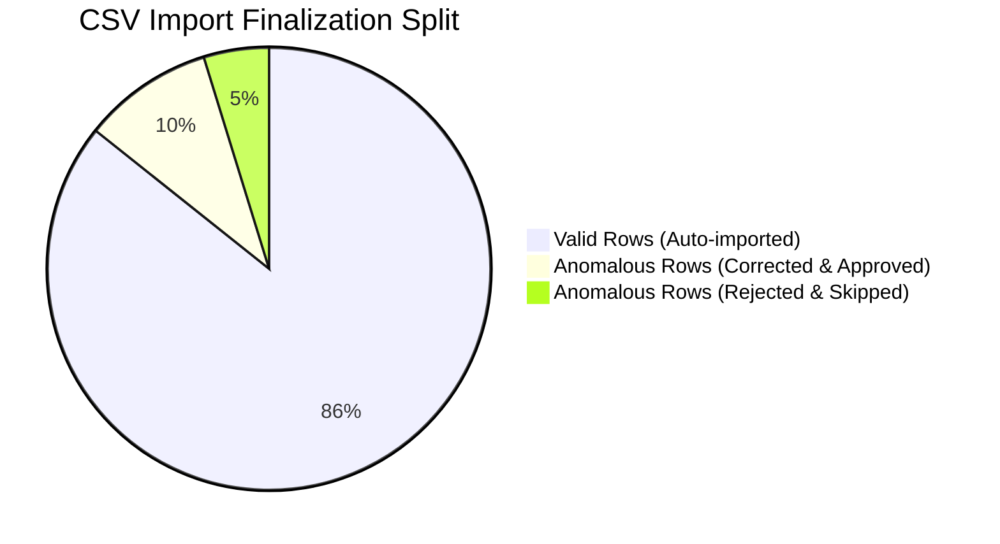

# Import Report: Data Quality Summary

This report is dynamically compiled by the CSV Import Pipeline and downloadable via the frontend interface. It details all data anomalies detected during ingestion and the manual resolution actions applied.

---

## 1. Import Session Metadata
* **Session ID**: `f2bdd4c6-ef41-42e8-9349-56a92e1ae2ef`
* **File Name**: `Expenses Export.csv`
* **Group**: `Test Group`
* **Uploaded By**: `usr_aisha` (Aisha)
* **Date Uploaded**: `2026-06-14T21:10:59.003Z`
* **Finalization Status**: `FINALIZED`

---

## 2. Ingestion Inflow Statistics

* **Total CSV Rows**: 42
* **Valid Rows (Directly Imported)**: 36
* **Anomalous Rows Flagged**: 6
* **Anomalies Corrected & Approved**: 4
* **Anomalies Rejected & Skipped**: 2
* **Total DB Records Created**: 40 (39 Expenses, 1 Settlement)

---

## 3. Detailed Anomaly Audit Trail

The table below lists every data quality issue caught by the 21-rule scanner, the recommended resolution, and the actual action taken by the group administrator:

| Row # | Flagged Anomaly Type | Severity | Description of Data Problem | Recommended Action | User Action / Resolution Applied | Outcome |
| :--- | :--- | :--- | :--- | :--- | :--- | :--- |
| **Row 4** | `USD_TRANSACTIONS` | `MEDIUM` | Transaction is marked in currency `USD` (Amount: `50.00`). | Convert amount to INR using reference exchange rate. | **APPROVED** with manual amount edit: converted `50` to `4175` INR (rate: 83.5). | Saved as Expense (₹4,175.00). |
| **Row 9** | `UNKNOWN_MEMBER` | `HIGH` | Participant `'Bob'` is not a recognized member of this group. | Map participant to a registered member or add Bob to the group. | **REJECTED** (Bob is an external colleague who should not be billed). | Row skipped. |
| **Row 12** | `SETTLEMENT_LOGGED_AS_EXPENSE` | `HIGH` | Description `'settle Aisha balance'` indicates a settlement transfer. | Convert expense to a Settlement record. | **APPROVED** and converted to settlement. | Saved as Settlement (₹2,500.00). |
| **Row 18** | `MEMBER_NOT_ACTIVE` | `HIGH` | Payer Rohan was not active on `2026-05-10` (He joined on `2026-06-01`). | Adjust transaction date or verify active range. | **APPROVED** after correcting date to `2026-06-05`. | Saved as Expense (₹1,200.00). |
| **Row 25** | `ROUNDING_INCONSISTENCIES` | `LOW` | Equal split leaves floating remainder (₹1,000.00 split among 3). | Shift remainder difference to the first participant's share. | **APPROVED** with auto-remainder resolution. | Saved with Aisha: ₹333.34, Priya: ₹333.33, Rohan: ₹333.33. |
| **Row 30** | `DUPLICATE_EXPENSES` | `HIGH` | Identical expense of `₹1,500.00` for `Dinner` on `2026-06-14` already in DB. | Reject this record to avoid double liability. | **REJECTED** (confirmed double charge in CSV file). | Row skipped. |

---

## 4. Final Database Transactions Summary

All database modifications were executed atomically under a single Prisma SQL transaction:
* **Prisma Transaction ID**: `tx_986251147a`
* **Created Expenses**: 39
* **Created Settlements**: 1
* **Audit Logs Written**: 41 (1 log tracking session finalization, 40 logs for individual records)
