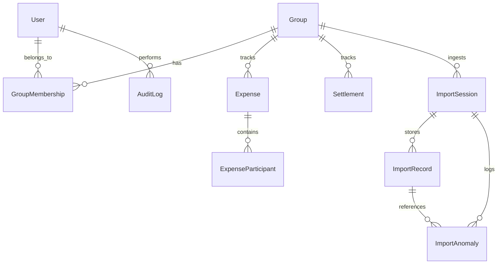

# Data Scope & Anomaly Log

This document details the CSV anomaly detection engine rules, how data quality problems are flagged and handled in staging, and the complete database schema.

---

## 1. CSV Anomaly Log & Validation Rules

To prevent garbage-in, garbage-out data pollution, our ingestion pipeline processes imported CSV files through a **21-rule validation scanner** before committing records.

| Rule ID | Anomaly Type | Severity | Description / Condition | Handling & Resolution Strategy |
| :--- | :--- | :--- | :--- | :--- |
| **1** | `BLANK_VALUES` | `HIGH` | One or more required columns (Date, Description, Amount, Payer, Participants) are empty. | Quarantined in staging. User must provide values manually before final import. |
| **2** | `EXTRA_WHITESPACE` | `LOW` | Fields contain leading or trailing spaces. | Automatically trimmed during ingestion. |
| **3** | `NEGATIVE_AMOUNTS` | `HIGH` | Expense amounts must be positive values. Negative values are flagged. | User must either flip to a positive amount or mark the row as rejected. |
| **4** | `REFUNDS` | `MEDIUM` | Description contains the word "refund" or amounts are negative. | Flagged for verification. Can be resolved as adjustments or normal expense splits. |
| **5** | `SETTLEMENT_LOGGED_AS_EXPENSE` | `HIGH` | Description contains settlement words (e.g. "settle", "paid to", "received from"). | Quarantined. Converted to a **Settlement** record instead of an Expense record on resolution. |
| **6** | `CURRENCY_MISMATCH` | `MEDIUM` | Transaction currency column is not `INR`. | Flagged for currency validation. |
| **7** | `USD_TRANSACTIONS` | `MEDIUM` | Currency code is explicitly set to `USD`. | Multiplies USD amounts by a standard reference rate (e.g., 83.5) on approval. |
| **8** | `INVALID_DATES` | `HIGH` | Value in the Date column cannot be parsed as a calendar date. | Quarantined. User must correct the date value to a valid format. |
| **9** | `DIFFERENT_DATE_FORMATS` | `MEDIUM` | Date is readable but uses non-standard formatting (e.g. slashes or `MM/DD/YYYY`). | Date is normalized to ISO standard `YYYY-MM-DD` on import. |
| **10** | `FUTURE_DATES` | `HIGH` | Transaction date falls after the current system date. | Date must be corrected to a past/current date or rejected. |
| **11** | `UNKNOWN_MEMBER` | `HIGH` | Payer or participant name/email does not match any current member in the group. | Quarantined. User must map the name to a valid database user or register them in the group. |
| **12** | `MEMBER_NOT_ACTIVE` | `HIGH` | Payer/Participant was not active in the group on the transaction date (based on timeline span). | User must adjust the date, extend the member's active span, or skip the participant. |
| **13** | `CASE_INCONSISTENCIES` | `LOW` | Spellings match database members but use mismatching casing (e.g. `aisha` vs `Aisha`). | Automatically resolved by normalizing to the registered DB user case. |
| **14** | `MISSING_PAYER` | `HIGH` | Payer column is empty or unparseable. | User must select a valid active group member as payer. |
| **15** | `MISSING_PARTICIPANTS` | `HIGH` | Participants column is empty (no one listed to share cost). | User must select at least one active member to split. |
| **16** | `SPLIT_TOTALS_MISMATCH` | `HIGH` | Split values count doesn't match participants count for non-EQUAL split configurations. | Corrected by entering individual split shares or changing split type. |
| **17** | `EXACT_SPLIT_MISMATCH` | `HIGH` | The sum of exact shares does not equal the total expense amount. | User must adjust exact values to sum to the total expense amount. |
| **18** | `PERCENTAGE_SUM_MISMATCH` | `HIGH` | Split percentages sum is not exactly 100%. | User must adjust percentages to total 100%. |
| **19** | `ROUNDING_INCONSISTENCIES` | `LOW` | Equal split division leaves floating-point decimal remainder discrepancies (e.g., ₹100.00 / 3). | Shift remainder differences (up to a ₹0.01 limit) to the first participant's share. |
| **20** | `DUPLICATE_EXPENSES` | `HIGH` | Identical expense (Same Date, Payer, Amount, Description) already exists in database. | Flagged to prevent double counting. Recommended action is to reject the row. |
| **21** | `ORPHAN_SETTLEMENTS` | `HIGH` | A settlement row lists multiple participants as payees (settlements can only be 1-to-1). | User must choose exactly one payee. |

---

## 2. Staging and Finalization Workflow

To ensure zero database pollution:
1. **Quarantine Ingest**: Imported CSV contents are stored in a draft state in `ImportSession` and `ImportRecord` staging tables. Valid rows are marked `VALID`; rows triggering any validator are marked `ANOMALOUS`.
2. **Review Board**: Flagged rows are presented in the staging workspace with details of their anomalies. The user has two options:
   * **Reject**: Mark the row `REJECTED`, which will skip database writing during finalization.
   * **Approve with Corrections**: Edit the fields (e.g. clean names, change dates, modify amounts) and mark `APPROVED`.
3. **Atomic Commit (Finalize)**: Clicking "Finalize" runs an atomic database transaction. Approved rows are written to the live `Expense` and `Settlement` tables, rejected rows are skipped, and the session status shifts to `FINALIZED`.

---

## 3. Database Schema

The platform uses PostgreSQL. The schema definitions are structured as follows:

### Table: `User`
Tracks user details.
* `id` (String, Primary Key): Unique authentication ID (Clerk or Mock user ID).
* `email` (String, Unique): User's primary email.
* `name` (String): Display name.
* `imageUrl` (String, Nullable): Profile picture link.
* `createdAt` / `updatedAt` (DateTime): Auditing timestamps.
* `deletedAt` (DateTime, Nullable): soft-delete indicator.

### Table: `Group`
Represents shared workspace accounts.
* `id` (String, Primary Key): Unique group ID (UUID).
* `name` (String): Group name.
* `description` (String, Nullable): Description details.
* `createdById` (String): Creator user reference.
* `createdAt` / `updatedAt` (DateTime): Timestamps.
* `deletedAt` (DateTime, Nullable): soft-delete indicator.

### Table: `GroupMembership`
Manages membership timeline slices.
* `id` (String, Primary Key): UUID.
* `groupId` (String, FK): Reference to `Group`.
* `userId` (String, FK): Reference to `User`.
* `joinedAt` (DateTime): Start date of member participation.
* `leftAt` (DateTime, Nullable): End date of member participation.
* `createdAt` / `updatedAt` (DateTime): Timestamps.
* `deletedAt` (DateTime, Nullable): soft-delete indicator.
* *Constraint*: Unique combination of `[groupId, userId, joinedAt]`.

### Table: `Expense`
Tracks recorded group expenses.
* `id` (String, Primary Key): UUID.
* `groupId` (String, FK): Reference to `Group`.
* `payerId` (String): Member who paid the expense.
* `amount` (Float): Expense total.
* `description` (String): Expense item name.
* `date` (DateTime): Expense transaction date.
* `splitType` (String): Split method (`EQUAL`, `EXACT`, `PERCENTAGE`, `WEIGHTED`).
* `createdAt` / `updatedAt` (DateTime): Timestamps.
* `deletedAt` (DateTime, Nullable): soft-delete indicator.

### Table: `ExpenseParticipant`
Resolves split shares per participant.
* `id` (String, Primary Key): UUID.
* `expenseId` (String, FK): Reference to `Expense`.
* `userId` (String): Participant user ID.
* `shareAmount` (Float): Calculated share in INR.
* `shareValue` (Float): Input raw value (percentage, weight, or exact).
* `createdAt` / `updatedAt` (DateTime): Timestamps.
* `deletedAt` (DateTime, Nullable): soft-delete indicator.

### Table: `Settlement`
Logs direct 1-to-1 payments.
* `id` (String, Primary Key): UUID.
* `groupId` (String, FK): Reference to `Group`.
* `payerId` (String): Member paying.
* `payeeId` (String): Member receiving funds.
* `amount` (Float): Total settled amount.
* `date` (DateTime): Payment date.
* `createdAt` / `updatedAt` (DateTime): Timestamps.
* `deletedAt` (DateTime, Nullable): soft-delete indicator.

### Table: `ImportSession`
CSV import staging batch records.
* `id` (String, Primary Key): UUID.
* `groupId` (String, FK): Reference to `Group`.
* `uploadedById` (String): User who imported the CSV.
* `status` (String): Session status (`PROCESSING`, `REQUIRES_REVIEW`, `PROCESSED`, `FINALIZED`).
* `fileName` (String): Name of the CSV file.
* `totalRows` / `importedRows` / `skippedRows` (Int): Row counts.
* `startedAt` / `completedAt` / `createdAt` / `updatedAt` (DateTime): Timestamps.

### Table: `ImportRecord`
Staging log of raw parsed CSV row lines.
* `id` (String, Primary Key): UUID.
* `sessionId` (String, FK): Reference to `ImportSession`.
* `rowIndex` (Int): Row number in the file.
* `rawContent` (String): JSON serialization of raw fields.
* `status` (String): Staging status (`PENDING`, `VALID`, `ANOMALOUS`, `APPROVED`, `REJECTED`).

### Table: `ImportAnomaly`
Quarantined data issues flagged by scanner.
* `id` (String, Primary Key): UUID.
* `sessionId` (String, FK): Reference to `ImportSession`.
* `recordId` (String, FK, Nullable): Reference to `ImportRecord`.
* `type` (String): Anomaly category (e.g. `USD_TRANSACTIONS`).
* `severity` (String): `LOW`, `MEDIUM`, or `HIGH`.
* `description` (String): Detailed error description.
* `recommendedAction` (String): Advice on resolution.
* `userDecision` (String): Resolution status (`PENDING`, `APPROVED`, `REJECTED`).
* `resolvedById` (String, Nullable): User who resolved the anomaly.
* `resolvedAt` (DateTime, Nullable): Timestamp of resolution.

### Table: `AuditLog`
Immutable system auditing log.
* `id` (String, Primary Key): UUID.
* `userId` (String, FK, Nullable): User performing action.
* `action` (String): Action event type (e.g., `EXPENSE_CREATED`, `MEMBER_LEFT`).
* `entityType` (String): DB Model name.
* `entityId` (String): UUID of modified record.
* `oldValues` (String, Nullable): Serialized JSON snapshot before edit.
* `newValues` (String, Nullable): Serialized JSON snapshot after edit.
* `timestamp` (DateTime): Auditing timestamp.
